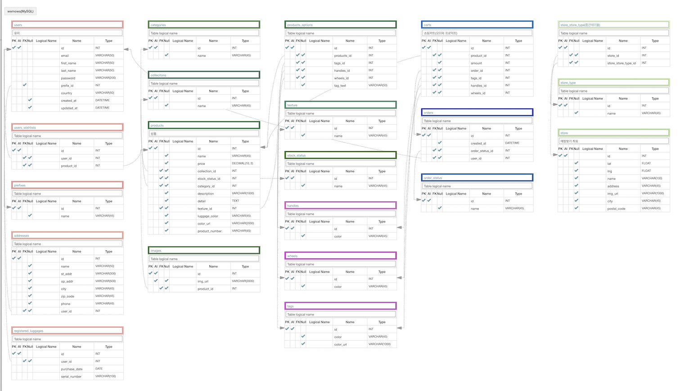

# Wemowa Project 소개 _ Backend
Rimowa의 캐리어 제품소개와 커스터마이징, 그리고 장바구니 담기와 찜하기등 e-commerce의 대표적인 기능을 제공하는 Rimowa Website Clone Project

 

## 개발 인원 및 기간
- 기간: 12일(5월 25일 ~ 6월 5일)
- Back-end members : [HyerangKim](https://github.com/RainaKim), [MisunKim](https://github.com/misuning)

 

## 데모영상

 

## 목적
- 웹페이지의 구조와 기능을 파악, 분석하여 모델링
- 상품들과 웹페이지 상세정보들을 크롤링
- 모델링을 기반으로 데이터베이스 생성 후 크롤링 한 데이터 넣기
- 필요한 기능들을 기준으로 views 작성
- views단위로 urls를 추가하여 최종으로 API 생성
- 프론트와 소통하여 data 전송

 

## 적용 기술 및 기능 구현

### 적용기술
- Python/Django
- Selenium
- BeautifulSoup
- Bcrypt
- Json
- JWT/token
- CORS Headers
- MySQL
- AWS EC2

 

### Database ERD Modeling

### 기능 구현

#### Account
- Sign-in/Sign-up (Bcrypt 암호화 및 JWT Access Token 전송)
- 로그인 검증을 위한 login decorator 구현
- 로그인 검증 후 wishlist(찜하기, 취소, 리스트보기)

#### Product
- Product list 보기(카테고리별)
- 가격순, 이름순으로 sort기능 구현
- 다중선택 필터링 기능 구현
- 제품이름 부분 검색 기능 구현
- 제품 상세페이지 구현
- 로그인 검증 후 특정제품이 wishlist에 추가된 상품인지 표시기능 구현

#### Store
- Store list 보기 기능 구현
- 부분 주소, 이름, 도시로 매장찾기 기능 구현

#### Order
- 장바구니 보기, 추가, 삭제 기능 구현
- 장바구니에서 '+'버튼 클릭시 장바구니에 담긴 제품수량 업데이트기능 구현
- 상품 일부 커스터마이징 기능 
- 주문기능 구현

 

## API documentation(POSTMAN)
[Rimowa Clone Project APIs](https://documenter.getpostman.com/view/11391580/SztEYmMw?version=latest#a828656c-7e65-43d0-893d-5bb6ef1ce209) 

